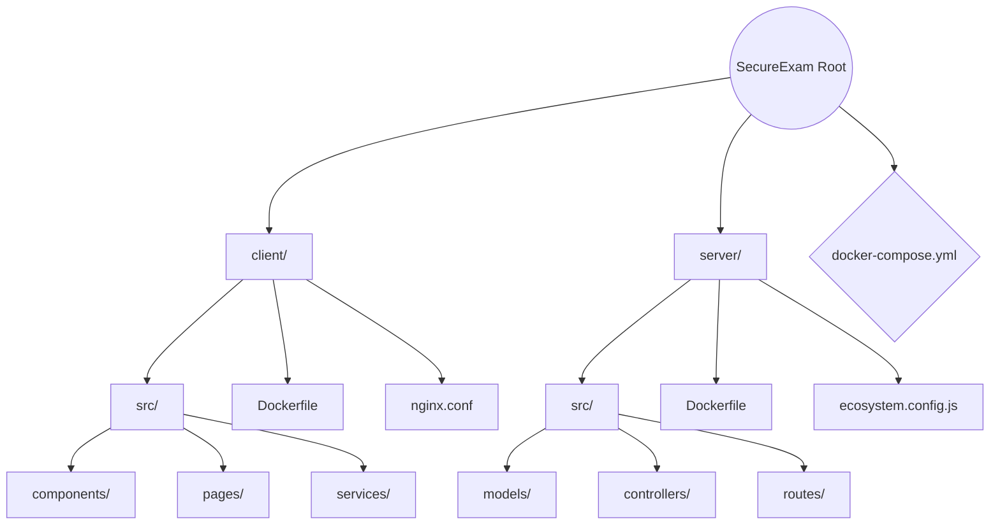

<div align="center">

<!-- Animated Typing Header -->


<p align="center">
  <strong>Modern, secure, and fully-featured online coding examination and proctoring platform.</strong>
</p>

<p align="center">
  <a href="#-stack"></a>
  <a href="#-stack"></a>
  <a href="#-stack"></a>
  <a href="#-stack"></a>
  <a href="#-stack"></a>
</p>


</div>

## ✨ Key Features

- 🔐 **Role-based Access Control (RBAC)** — Dedicated interfaces for Students, Instructors, and Administrators.
- ⚡ **Real-time Code Execution** — Instant compilation and execution using integrated Monaco Editor.
- 📝 **Exam Management** — Seamlessly create, schedule, evaluate, and grade coding assessments.
- 🛡️ **Tamper-proof & Secure** — Kiosk environment-ready, effectively blocking background shortcuts and screenshots (perfectly couples with Electron.js wrappers).
- 🐳 **Dockerized Infrastructure** — Instantly deployable and isolated instances ready for high-scale environments.

<br>

## 🛠️ Stack

The ecosystem is split into isolated client and server instances, both deeply utilizing TypeScript.

**Frontend 🎨**
>     

**Backend ⚙️**
>    

**Database & Infra 🐳**
>    

<br>


## 🚀 Development

### 📋 Prerequisites
Ensure you have the following installed on your local environment before proceeding:
- Node.js 18+
- MongoDB (running locally or via MongoDB Atlas)

### 💻 Setup

<details>
<summary><b>Server Configuration ⚙️</b> (Click to Expand)</summary>

Create a `.env.development` file in the `server` directory and fill in the required details:

```env
# server/.env.development
NODE_ENV=<development_or_production>
PORT=<your_port_number>

MONGO_URI=<your_mongodb_connection_string>
JWT_SECRET=<your_secure_jwt_secret>
JWT_EXPIRY=<jwt_expiry_time>

CORS_ORIGINS=<comma_separated_allowed_origins>
FRONTEND_URL=<your_frontend_url>
```

```bash
cd server
npm install
npm run dev
```
</details>

<details>
<summary><b>Client Configuration 🎨</b> (Click to Expand)</summary>

Create a `.env.development` file in the `client` directory and fill in the details like so:

```env
# client/.env.development
VITE_API_URL=<your_api_url>
```

```bash
cd client
npm install
npm run dev
```
</details>

> 💡 **Tip:** Active client runs on [`http://localhost:5173`](http://localhost:5173), and the backend API server sits on [`http://localhost:5000`](http://localhost:5000).

<br>


## 📦 Production Deployment

### 1️⃣ Configure Platform Secrets

Create the production environment files and fill in the required details:

**Server Environment (`server/.env.production`):**
```env
NODE_ENV=production
PORT=<your_production_port>
MONGO_URI=<your_production_mongodb_connection_string>
JWT_SECRET=<your_secure_jwt_secret>
JWT_EXPIRY=<jwt_expiry_time>
CORS_ORIGINS=<comma_separated_allowed_production_origins>
FRONTEND_URL=<your_production_frontend_url>
```

**Client Environment (`client/.env.production`):**
```env
VITE_API_URL=<your_production_api_url>
```

**MongoDB Credentials (`mongo.env`):**
```env
MONGO_INITDB_ROOT_USERNAME=<your_db_admin_username>
MONGO_INITDB_ROOT_PASSWORD=<your_db_admin_password>
```

> ⚠️ **SECURITY WARNING:** Never push `.env.production` or `mongo.env` with real credentials to source control targeting public or untrusted domains.

### 2️⃣ Secure SSL Certificate Automation
Generate a safe certificate through Let's Encrypt standalone service for your own domain. Validate port `80` configuration appropriately:
```bash
certbot certonly --standalone -d <your_domain.com> -d <www.your_domain.com>
```

### 3️⃣ Scale & Deploy via Docker Compose
Build architecture binaries and launch resilient containers in detached mode:
```bash
docker compose up -d --build
```

### 4️⃣ Confirm Health Status
Instantly verify the server availability and API readiness structure:
```bash
curl https://securexam.info/api/health
```

<br>


## 🗂️ Project Structure

Using Mermaid standard graphs, observe our full project overview separating logic models perfectly per target layer:



<br>

<div align="center">
  <sub>Built with ❤️ by Bersinberz. © 2026</sub>
</div>
